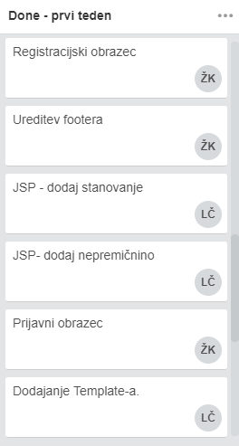
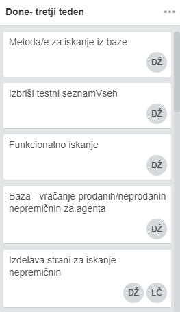
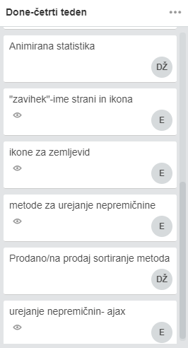
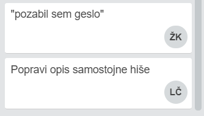

# O projektu

Projekt je bil narejen za predmet PRAKTIKUM 1 pri smeri ITK UN na FERI. Razvili smo ga z znanjem, ki smo ga pridobili v 1. letniku, zato smo uporabili jezike in tehnologije ki so nam najbolj poznane. Razvoj je trajal pet tednov, pod vodstvom asistentke Lucije Brezočnik.

# Naloga
Nepremičninska agencija želi voditi pregled nad nepremičninami, ki jih zastopa. 
Nepremičninski agent lahko v sistem vstavi novo nepremičnino. Nepremičnina je lahko stanovanje,
hiša ali posest.
Za vsako stanovanje je potrebno vnesti naslednje obvezne parametre:

- kraj,
- kvadraturo,
- število sob v stanovanju,
- letnik izgradnje,
- nadstropje v bloku,
- ali je stanovanje prenovljeno,
- ali ima stanovanje garažo,
- ali ima stanovanje balkon,
- ceno,
- naslov.

Agent lahko doda tudi dodaten opis stanovanja, kjer so zbrani podatki glede ogrevanja, energijskega razreda, telekomunikacijskega
omrežja ipd. Vsako stanovanje ima tudi galerijo slik, kjer so objavljene slike stanovanja, tlorisi ipd.

Podobno kot pri stanovanju mora nepremičninski agent vnesti naslednje obvezne parametre za vsako
hišo, ki jo skuša prodati: kraj, kvadratura, vrsta (samostojna, dvojček, vrstna), nadstropje, ali je
vključena garaža, velikost zemljišča, cena in naslov. Tudi tukaj lahko doda dodaten opis hiše in galerijo
slik.

Če agent prodaja posest, mora vnesti naslednje obvezne parametre: tip posesti (zazidljiva, nezazidljiva,
kmetijsko zemljišče), velikost zemljišča, ceno in naslov. Možen je še dodaten opis posesti in galerija
slik.

Ob prijavi ima nepremičninski agent na voljo svojo nadzorno ploščo (angl. dashboard), kjer ima zbrane
osnovne podatke – število nepremičnin, ki jih trenutno zastopa, število prodanih nepremičnin ipd.
Neregistriran uporabnik ima na naslovni strani možnost pregleda zadnjih petih dodanih nepremičnin.
Brska lahko med dodanimi nepremičninami s pomočjo naprednih filtrov, npr. hočem stanovanje na
področju Maribora, ki ima vključeno garažo.

# Razvoj funkcionalnosti
 Na začetku vsakega tedna smo določili cilje, ki smo jih morali tisti teden izpolniti.
 
## Prvi teden
Prvi teden smo naredili osnovno strukturo projekta, izbrali template in ga vključili v projekt. Dodali smo tudi registracijo in prijavo ter dodajanje nepremičnin in uredili grafično podobo template-a. Izdelali smo tudi podatkovno bazo in jo povezali s stranjo.

  
   
  
  

## Drugi teden
Drugi teden smo dodali brisanje nepremičnin, dodajanje slik, kontrolno ploščo ter uredili naslovno stran. Dodalo smo tudiveliko funkcionalnosti  kot so posodobitev podatkov in slik, gumb za pomik na vrh strani in zemljevid.

  
   
  
  

## Tretji teden
Tretji teden smo uspodobili iskanje nepremičnin in potrditev registracije ter brisanje nepremičnin in prikaz natančne lokacije.

  
   
  
  

## Četrti teden
Četrti teden smo naredili testne podatke in usposobili urejanje nepremičnin z ajaxom. Naredili smo tudi prikaz slik nepremičnin in dodali funkcijo za pozabljeno geslo, pošiljanje nepremičnine na mail in sortiranje nepremičnin. 

  
   
  

## Avtorji
 | | | |
:---: |:---: |:---: |:---: |
[EvaSmolak](https://github.com/EvaSmolak) |[CetinaLuka](https://github.com/CetinaLuka) |[KovacZan](https://github.com/KovacZan) |[ZeleDavid](https://github.com/ZeleDavid) |

# Povezave do dodatne dokumentacije
- <a href="baza.md">Podatkovna baza</a>
- <a href="namestitev.md">Navodila za namestitev</a>
- <a href="dependencies.md">Uporabljene knjižnjice</a>
