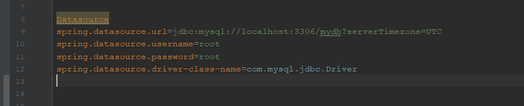
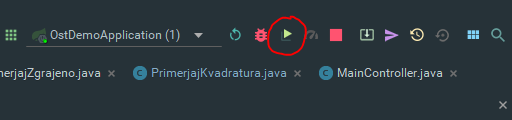

# Navodila za namestitev

Najprej potrebujete uspešno nameščen IntelliJ in MySQL. 
Za optimalno kompatibilnost našega projekta je nujno ustrezno namestiti predvsem program MySQL (ob inštalaciji nastaviti uporabniško ime in geslo za lokalno gosten strežnik).
1. Na spletni strani github.com prenesite naš repozitorij, tako da izberete opciji clone ali download.
2. S programom intellij odprite mapo "NepremicninskaAgencija".
3. V programu MySQL naredite lokalni strežnik in na njem ustvarite novo shemo s skripto "Kreiranje tabel.sql", ki jo najdete v mapi "ER diagram".
4. Ko je baza kreirana, se lahko posvetimo odvisnostim v projektu. Omogočiti je potrebno avtomatski uvoz Maven odvisnosti. Prav tako je potrebno nastaviti ustrezna vrata (po privzetem so izbrana kar 3306) ter uporabniško ime in geslo enako kot je določeno v MySQL-u. Oboje se nahaja v datoteki application.properties na lokaciji vidni na sliki. 

5. Projekt poženete tako da v intelliJ pritisnete zelen gumb "poženi".

6. V brskalniku napišite v iskalno vrstico http://localhost:8080.
Če so vrata 8080 pri vas že zasedena jih spremenite.
